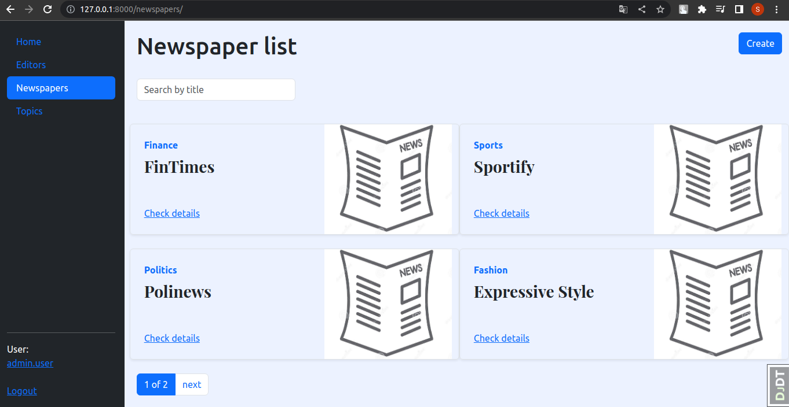

 

# Newspaper Agency Tracker

Project for managing the publishing process of a newspaper agency by tracking the work of editors assigned to newspapers published by the agency

## Check it out 
[Newspaper agency tracker project deployed to Render](POST_LINK_HERE)

- **_login_**: user
- **_password_**: user12345

## Installation
Python3 must be already installed

```shell
git clone https://github.com/SergiiMachulin/newspaper-agency-tracker
cd newspaper
python -m venv venv
source venv/bin/activate (on Linux/maOS)
venv\Scripts\activate (on Windows)
pip install -r requirements.txt
python manage.py runserver 
```

## Features
* Authentication functionality for Editor/User
* Managing topics newspapers & editors directly from website interface
* Powerful admin panel for advanced managing

## Demo

